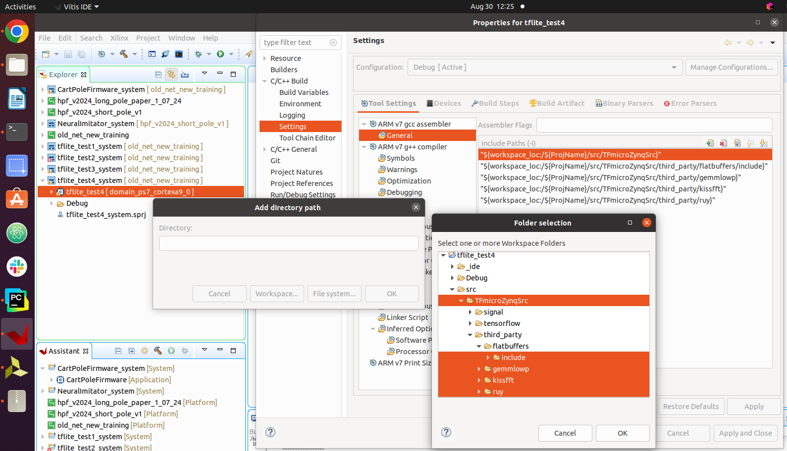

# TFmicroZynq

## Overview
Files needed to deploy neural networks on Zynq-Z7 with TF lite micro 
together instructions how to do it
and with python script to convert TF models directly to the  C++ files which TF micro can use.

## Repository structure
- `TFmicroZynqSrc/` - Files which needs to be included as part of your Zynq C++ firmware project
- `Auxiliary_Files/` - Files which were altered, removed or added related to default to make the deployment possible
- `TFmicroZynqLib/` - TF micro library compiled as static library.
  - `TFmicroZynqLib/libTFmicroZynq.a` - The static library archive file
  - `TFmicroZynqLib/TFmicroZynqHeaders/` - Include the headers file for the library. At the moment of writing this README, it is exact copy of `TFmicroZynqSrc/` just with .cc files removed.
  - `TFmicroZynqLib/tfmicrozynq.h` - header-only interface layer for the library to simplify including tf micro library. Just include this file in your project.
- `Convert_Network_To_TFlitemicro.py` - Launch this script to convert your neural network to TFmicro format.
- `Example/` - Example of how to use the TFmicro on Zynq-Z7
You can also find relevant parameters in this script.

## How to deploy neural network on Zynq-Z7 (tested on Vitis 2020.1)

I've tested 2 ways of including TF micro in Vitis project:
- Including files in the project and building everything together.
First build takes a lot of time, but later incremental builds are fast.
It is however to me difficult to predict when Vitis decides it needs to rebuild everything.
- Building TF micro as a static library and linking it to the project.
Slow build of the library, but builds of the application are very fast.

We first describe how to compile TF micro file together with your application,
below instructions how to compile and use TF micro as static library.

### A. Including .cc TF micro files in Vitis and compiling all files together

1. Create a new application project,
We tested it with the "Empty Application (C++)" template.

2. Copy the `TFmicroZynqSrc/` directory to the `src/` directory of your project,
or create a symbolic link. Don't use Vitis to create the symbolic link, 
as the compilation fail for us if we do so.
Instead use the tools of your OS. 
E.g. on Ubuntu you can open TFmicroZynq and your Vitis project in two windows of file system,
and drag the `TFmicroZynqSrc/` directory to the `src/` directory of your project while holding shift and ctrl keys.

3. Right click on the {project_name}_system in Explorer pane, select "C/C++ Build Settings".
You might want to change "Configuration:" to "All configurations", 
as the changes are needed in both release and debug configuration if you want to use them.
In Settings -> Tool Settings -> System Builder -> Miscellaneous -> Other flags add:
```-std=c++2a``` and click "Apply and Close". This will allow you to use C++20 features on the system level.
You can also activate the "Verbose" checkbox (optional).

4. Right click on the {project_name} in Explorer pane
(one line below where you were before), select "C/C++ Build Settings", go to Settings.
You might want to again change "Configuration:" to "All configurations".

    - Assembler (ARM v7 gcc assembler) -> General -> Include paths (-I) -> add (icon with plus) -> Workspace... ->
      select the `TFmicroZynqSrc/`, `flatbuffers/include`, `gemmlowp`, `kissfft` `ruy` click "OK" and "Apply".
      Notice that you need to select include folder inside flatbuffers, not the flatbuffers folder itself.
      See the screenshot below, how it should look like.
      The paths in the "Include Paths (-I)" window will appear only after clicking "OK".
      
    - Compiler (ARM v7 g++ compiler) -> Directories -> Include paths,
      Add the same paths as in the previous step, click "Apply".
    - Compiler (ARM v7 g++ compiler) -> Defined Symbols -> Defined symbols (-D), add:
        ```TF_LITE_STATIC_MEMORY```, click "Apply".
        It seems without this flag TF micro tries to compile in some obsolete, 
        no longer supported & no compilable mode.
    - Compiler (ARM v7 g++ compiler) -> Miscellaneous -> Other flags, add:
        ``` -std=c++2a -fno-exceptions```, click "Apply".
        First flag allows you to use C++20 features in the code,
        second flag disables exceptions, which leads to crash
        of the compilation, without being essential for the TFmicro.
    - Linker -> Libraries -> Libraries (-l), add:
        ```m```, click "Apply".
        This will link the standard math library.
    - Optional: Compiler (ARM v7 g++ compiler) -> Optimization -> Optimization Level,
        for Debug configuration set to "None (-O0)", for Release configuration set to "Optimize most (-O3)".

5. Click on the {project_name}_system in Explorer pane,
either right click and select Build Project or click on the hammer icon.
Clicking at a small arrow next to the hammer icon, you can select build configuration.

### B. How to use TF micro precompiled as static library

1. Do points 1-3 from the previous section (A.). Just instead of copying the `TFmicroZynqSrc/` directory,
copy the `TFmicroZynqLib/` directory to the `src/` directory of your project.
2. Right-click on the {project_name} in Explorer pane
(one line below where you were before), select "C/C++ Build Settings", go to Settings.
You might want to change "Configuration:" to "All configurations".

    - Compiler (ARM v7 g++ compiler) -> Directories -> Include paths -> add (icon with plus) -> Workspace... ->
      select the `TFmicroLib/TFmicroZynqHeaders/`, `flatbuffers/include`, `gemmlowp`, `kissfft` `ruy` click "OK" and "Apply".
      Notice that you need to select include folder inside flatbuffers, not the flatbuffers folder itself.
      See the screenshot for section A.4., how it should look like.
      Notice that in contrast to A.4. here the parent directory is `TFmicroZynqLib/` not `TFmicroZynqSrc/`.
      The paths in the "Include Paths (-I)" window will appear only after clicking "OK".
      Click "Apply".
    - Compiler (ARM v7 g++ compiler) -> Miscellaneous -> Other flags, add:
        ``` -std=c++2a```, click "Apply".
    - Linker -> Libraries:
        - -> Libraries (-l) -> add ```m```, click "OK". This will link the standard math library.
        - -> Libraries (-l) -> add ```TFmicroZynq```، click "OK"
          (This should be the name of .a library file without the `lib` prefix and `.a` suffix).
        - Library search path -> add (icon with plus) -> Workspace... -> select the `TFmicroZynqLib/` directory,
          click "OK" and "Apply".
     - Optional: Compiler (ARM v7 g++ compiler) -> Optimization -> Optimization Level,
         for Debug configuration set to "None (-O0)", for Release configuration set to "Optimize most (-O3)".

3. Click on the {project_name}_system in Explorer pane,
either right click and select Build Project or click on the hammer icon.
Clicking at a small arrow next to the hammer icon, you can select build configuration.

### C. How to compile TF micro as static library on your own

1. Create a new *library project*.
Name it `TFmicroZynq`.
You can also name it differently, but then your static library archive file (a.)
will have a different name than in section B.
You need to select a hardware platform,
but as this library does not communicate to PL,
it seems to work properly also if you later use the compiled library
with an application using different hardware platform.
Use Empty Application (C++) template.

2. Follow the steps A.2., A.3, A.4.
You will need to skip the linking math library step.
I built it only in release configuration.
I set the optimization level to "Optimize most (-O3)" and Debug None to increase the performance.
You can use the library with higher level of optimization and no debugging,
with an application with different settings.

3. Click on the {project_name} in Explorer pane,
either right click and select Build Project or click on the hammer icon.
Clicking at a small arrow next to the hammer icon, you can select build configuration.

4. After the build is finished,
you can find the static library `libTFmicroZynq.a` archive file in the `Debug/` or `Release/` directory of your project.
If you click on {project_name}_system and request the build the Vitis will claim that the build failed,
as it will try to obtain a bootable image.
If the settings for library compilation were correct,
the library should be however still compiled correctly and the .a file should be available.

### Using the example
Just copy the files from the `Example/` directory of this repo to the `src/` directory of your project and build the project.
This example is based on the default hellow_world example for TF micro, but for a multi input network with tanh activation.


### Converting the network

The script `Convert_Network_To_TFliteMicoro.py` was intended to work with networks created with [SI_Toolkit](https://github.com/SensorsINI/SI_Toolkit),
and hence make use of additional metadata ("net_info").
It would be however easily adjustable to convert any networks to TFmicro format:
just replace the import of the network model, with your function and provide the size of the input tensor.

You can provide the path to your network in `Convert_Network_To_TFliteMicoro.py`,
the newly generated files will be saved in the same location.

You can directly use it with the example above,
just copy the generated files to the `src/` directory of your project,
and change the `#include "Dense_7IN_32H1_32H2_1OUT_0_model.h"` header in the `hello_world_test.cc` appropriately.

Additionally, the python script generated the golden input and output for the network,
which you should exchange in the `hello_world_test.cc` file for network to pass the tests.


## How the files in this repository were created
We followed step 1 from the official
[instruction](https://github.com/tensorflow/tflite-micro/blob/main/tensorflow/lite/micro/docs/new_platform_support.md),
for creating tensorflow micro files from general repository.
We removed the example folder, `tensorflow/lite/micro/span_test.cc` and `tensorflow/lite/micro/static_vector_test.cc`,
and modified `tensorflow/lite/micro/micro_time.cc` and `tensorflow/lite/micro/system_setup.cc`

## Auxiliary files
### Removed
These are files which needed to be removed from the default files package to make compilation possible.

`tensorflow/lite/micro/span_test.cc` and `tensorflow/lite/micro/static_vector_test.cc` 
comes with their own main function.
One can just exclude them from the compilation, 
but to make setup easier we removed them from sources to be imported into the project.

If you happen to need them and rather exclude them from compilation,
just right-click on the file in the Explorer pane,
select "Properties" -> "C/C++ Build" -> "Exclude resource from build".
The option is available only if you click on a single file, not multiple files at once.
You can also select to exclude with form one or all configurations.

We also removed from TFmicroZynqSrc the whole official `examples` folder,
which can be found now in `Auxiliary_Files/Removed`.

### Altered
As described in [the instruction for creating tensorflow micro files from general repository](https://github.com/tensorflow/tflite-micro/blob/main/tensorflow/lite/micro/docs/new_platform_support.md),
one need in general to adjust these files:
- `tensorflow/lite/micro/debug_log.cc`
- `tensorflow/lite/micro/micro_time.cc`
- `tensorflow/lite/micro/system_setup.cc`

For Zynq Z7 `debug_log.cc` the default implementation works fine.
Following the [Sparkfun Edge example](https://github.com/advaitjain/tflite-micro-sparkfun-edge-examples/tree/120f68ace95ae3d66963977ac7754acd0c86540d/tensorflow/lite/micro/sparkfun_edge), 
mentioned in the above-mentioned [instruction](https://github.com/tensorflow/tflite-micro/blob/main/tensorflow/lite/micro/docs/new_platform_support.md),
We cleared all content from `micro_time.cc` and put initialization and timing functions into `system_setup.cc`.
The modified files are at the location named above and the original files are in the `Auxiliary_Files/Altered` directory.

## Other notes

#### Compilation time
The program compiles quite long!
Probably around 10 minutes for the first time.
Later incremental compilation is completed usually within few seconds.

#### Memory usage
TF lite takes roughly 0.5 MB of memory.

#### Debug vs Release configuration
The network built in Release configuration is roughly 3x faster than network built in Debug configuration.

#### Neural Control Tools
We purposely did not include this repo as submodule of the
[Neural Control Tools](https://github.com/SensorsINI/Neural-Control-Tools)
as it is quite big and needed only for few experiments. 

#### Floating-Point Unit
The Zynq Z7 PS (ARM Cortex A9) has a VFPv3 floating point unit.
It usage is enabled by default in the compiler with the flags `-mfpu=vfpv3 -mfloat-abi=hard `.
It should handle single and double precision floating point operations.
[Wikipedia states](https://en.wikipedia.org/wiki/ARM_architecture_family#Advanced_SIMD_(NEON))
that disabling it should "require roughly ten times more clock cycles per float operation." TODO: check this.

It should be also possible to enable the NEON unit with the flags
`-mfpu=neon -funsafe-math-optimizations -mfloat-abi=hard`
but when we tested we got a slight increase of computation time (from 45 us to 48 us).
Maybe it needs some more changes to enable correctly? We don't know.
We see there are similar flags for linker, not only compiler, maybe this is the reason?
